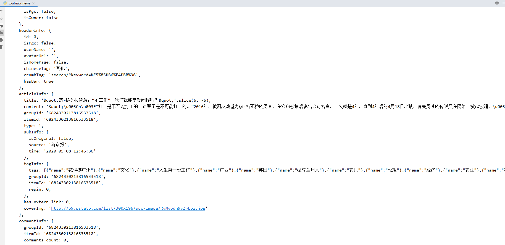

# Toutiao_Spider

### 声明：项目内容不得用于商业用途，仅做学习交流，如果侵犯了您的利益和权益,请邮箱联系我，我将删除该项目。

| 作者    | 邮箱                                                |
| ------- | --------------------------------------------------- |
| liberty | [fthemuse@foxmail.com](mailto:fthemuse@foxmail.com) |

### 

## 介绍

爬取今日头条新闻详情页内容，Nodejs 本地动态生成 Cookies 中 key 为 `__ac_signature` 的值


## 目录结构

- sign.js（生成 `__ac_signature` 文件）
- web_server.js（web_server 文件）
- toubiao_news.py（爬虫文件）


## __ac_signature 生成需要的参数

```
__ac_nonce	# 第一次请求新闻详情页时，response cookies中获取
url			# 当前新闻详情页 url
userAgent	# 请求头
```

#### 

## 环境依赖库

### Python

- requests


### NodeJS

- express


## 使用说明

1.  使用 `Nodejs` 运行 `web_server.js`，启动 `web`服务；
2.  执行 `toubiao_news.py`开始爬取。


## 执行结果

